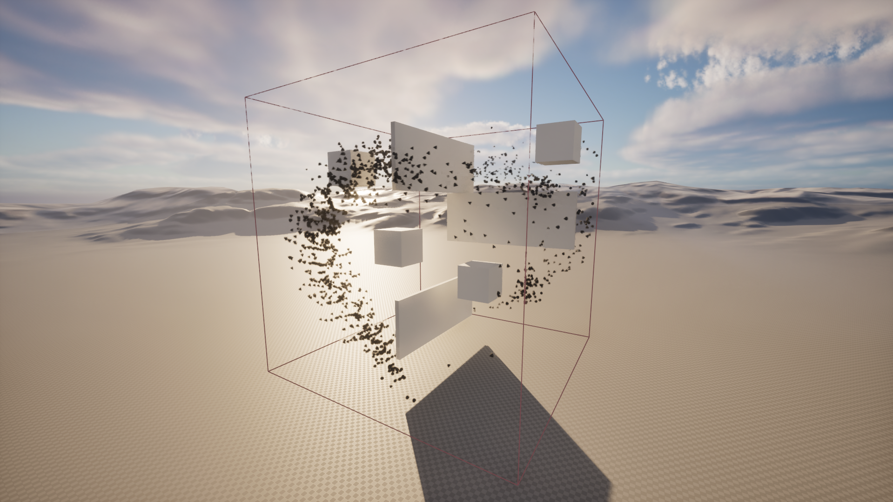
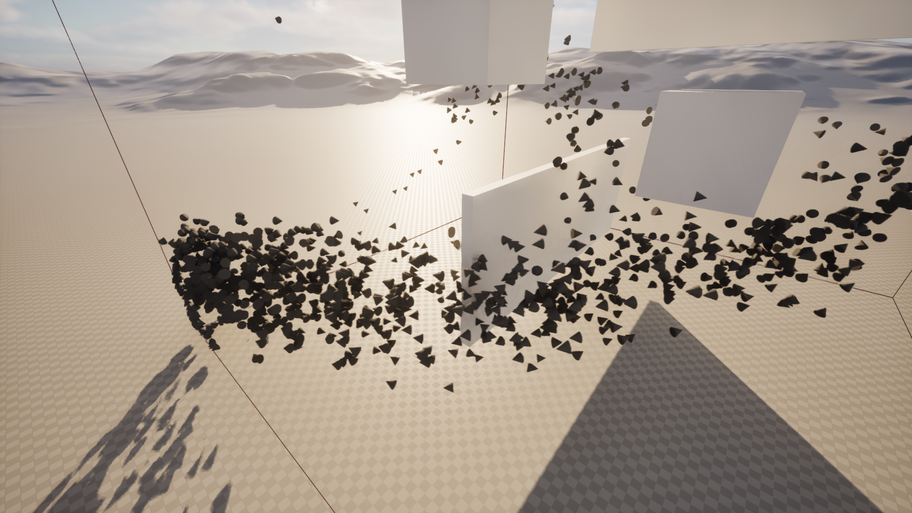
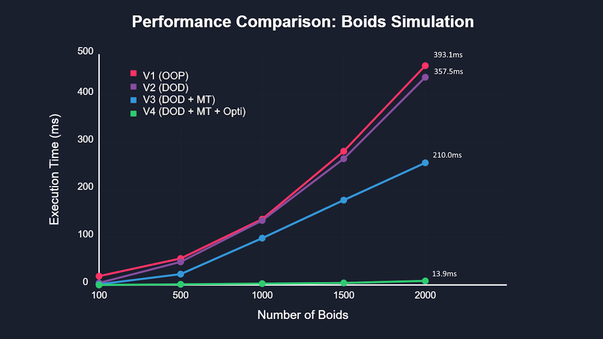
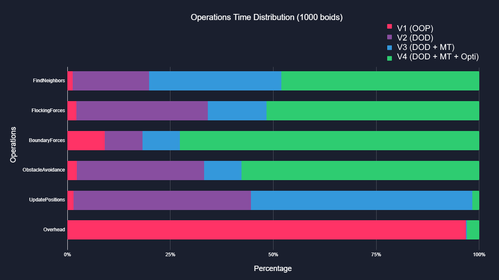
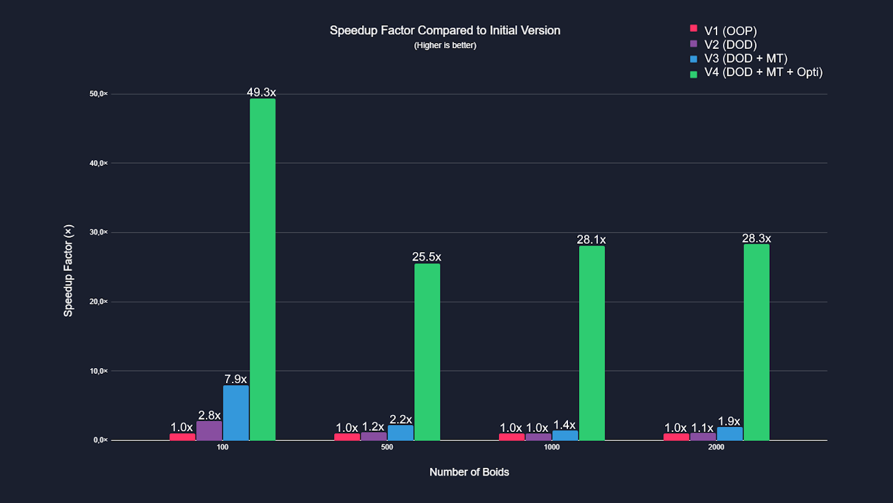
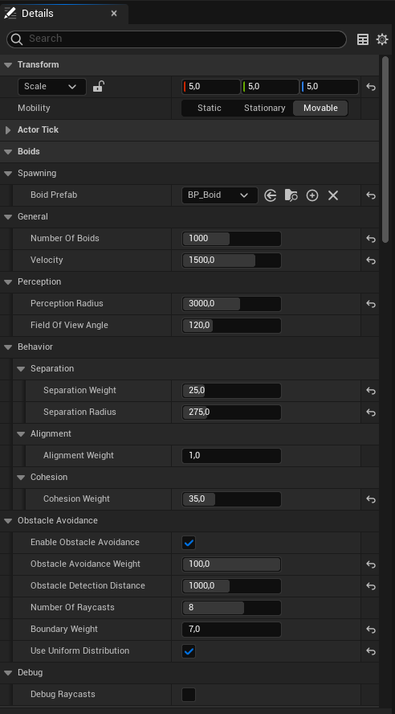
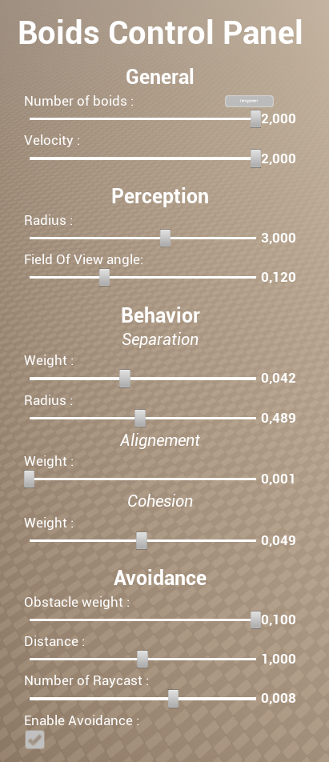

# Boids--UnrealEngine5-2025

A highly optimized flocking behavior simulation system implemented in Unreal Engine 5 using C++. This project recreates the classic "boids" algorithm by Craig Reynolds with significant optimizations to support thousands of autonomous agents in real-time, built on principles from his paper ["*Steering Behaviors For Autonomous Characters*"](https://www.red3d.com/cwr/steer/gdc99/).




## Summary

- [Project Pitch](#project-pitch)
- [Project Demo](#project-demo)
- [Technical Section](#technical-section)
- [How to Use the Project](#how-to-use-the-project)
- [Possible Improvements](#possible-improvements)

## Project Pitch

This project implements a flocking behavior simulation system inspired by Craig Reynolds' seminal "Boids" algorithm (1987) and his steering behaviors paper. The system simulates realistic group movements seen in nature such as bird flocks, fish schools, and herds of land animals.

### **Features included:**
- Highly optimized Data-Oriented Design (DOD) architecture
- Multi-threaded processing for computationally intensive operations
- Dynamic neighbor detection with configurable field of view
- Obstacle avoidance system with configurable raycast detection
- Smooth boundary avoidance keeping boids within specified area
- Implementation of the three core flocking principles: *`separation`*, *`alignment`*, and *`cohesion`*
- Performance tuned to handle thousands of boids in real-time
- User interface for controlling simulation parameters

### **Controls:**
#### Mouvements
- Forward > `W`
- Left > `A`
- Backward > `S`
- Right > `D`
- Look > `Mouse`

#### User Interface
- Show/Hide interface > `Escape`
- Interact > `Mouse`

## Project Demo

### Performance Evolution
The project evolved through four major versions, each with significant performance improvements:

> Note: While Compute Shaders would provide massive performance gains, this project deliberately focuses on CPU-only optimizations as a technical exercise.

legend glossary :

- `OOP` > *Object-Oriented Programming*
- `DOD` > *Data-Oriented Design*
- `MT` > *Multithreading*
- `Opti` > *Optimisations*



| Version | Description | 100 boids | 500 boids | 1000 boids | 2000 boids |
|---------|-------------|-----------|-----------|------------|------------|
| V1 (OOP) | Initial object-oriented implementation | 19.7 ms | 66.4 ms | 151.9 ms | 393.1 ms |
| V2 (DOD) | Data-oriented design refactoring | 7.0 ms | 57.2 ms | 150.5 ms | 357.5 ms |
| V3 (DOD+MT) | Added multi-threading | 2.5 ms | 29.7 ms | 108.2 ms | 210.0 ms |
| V4 (DOD+MT+Opti) | Targeted optimizations | 0.4 ms | 2.6 ms | 5.4 ms | 13.9 ms |

### Execution Time Distribution
The following chart shows how processing time is distributed across different operations for 1000 boids:



| Operation | V1 (OOP) | V2 (DOD) | V3 (MT) | V4 (Optimisation) |
|-----------|----------|----------|---------|------------|
| FindNeighbors | 1.6 ms (1.1%) | 14.4 ms (9.6%) | 14.4 ms (13.4%) | 2.0 ms (37.0%) |
| FlockingForces | 0.3 ms (0.2%) | 2.8 ms (1.9%) | 0.9 ms (0.8%) | 0.4 ms (7.4%) |
| BoundaryForces | 0.01 ms (~0%) | 0.01 ms (~0%) | 0.01 ms (~0%) | 0.04 ms (0.7%) |
| ObstacleAvoidance | 3.8 ms (2.5%) | 38.9 ms (25.8%) | 6.4 ms (5.9%) | 2.6 ms (48.1%) |
| UpdatePositions | 3.0 ms (2.0%) | 94.3 ms (62.7%) | 86.4 ms (79.8%) | 0.2 ms (3.7%) |
| Overhead | 142.9 ms (94.2%) | 0.1 ms (0.1%) | 0.1 ms (0.1%) | 0.2 ms (3.1%) |
| **Total** | **151.9 ms** | **150.5 ms** | **108.2 ms** | **5.4 ms** |

### Speedup Factor
This chart illustrates the relative performance improvement of each version compared to the initial implementation:



| Population | V1→V2 | V1→V3 | V1→V4 | V3→V4 | V1→V4 (Final) |
|------------|-------|-------|-------|-------|---------------|
| 100 boids | 2.8× | 7.9× | 49.3× | 6.3× | 49.3× |
| 500 boids | 1.2× | 2.2× | 25.5× | 11.4× | 25.5× |
| 1000 boids | 1.0× | 1.4× | 28.1× | 20.0× | 28.1× |
| 2000 boids | 1.1× | 1.9× | 28.3× | 15.1× | 28.3× |

## Technical Section

The project architecture incorporates several advanced techniques that contribute to its exceptional performance. Here are the most significant technical aspects not covered previously:

### 1. System-Manager-UI Architecture

The project uses a three-tier architecture for clean separation of concerns:

```
┌─────────────────┐     ┌─────────────────┐     ┌─────────────────┐
│                 │     │                 │     │                 │
│   BoidSystem    │◄────│  BoidsManager   │◄────│       UI        │
│  (Simulation)   │     │  (Coordination) │     │  (User Input)   │
│                 │     │                 │     │                 │
└─────────────────┘     └─────────────────┘     └─────────────────┘
```

```cpp
// BoidsManager acts as intermediary between UI and simulation system
void ABoidsManager::SyncParametersToSystem() const
{
    if (BoidSystem)
    {
        // Pass configuration from UI/Editor to simulation system
        BoidSystem->SetBehaviorParameters(
            SeparationWeight,
            AlignmentWeight,
            CohesionWeight,
            SeparationRadius,
            PerceptionRadius,
            BoundaryWeight,
            Velocity,
            FieldOfViewAngle
        );
        
        BoidSystem->SetObstacleAvoidanceParameters(
            ObstacleAvoidanceWeight,
            ObstacleDetectionDistance,
            NumberOfRaycasts,
            bEnableObstacleAvoidance
        );

        BoidSystem->SetUseUniformDistribution(bUseUniformDistribution);
    }
}
```

This architecture provides several benefits:
- **Decoupling**: BoidSystem handles pure simulation logic without UI concerns
- **Centralized parameters**: BoidsManager acts as a configuration hub
- **Clean testing**: Each component can be tested in isolation
- **Performance isolation**: Simulation runs without UI overhead

### 2. Optimized Combined Force Calculation

Instead of iterating through neighbors multiple times for each force, the system calculates all three forces in a single pass:

```cpp
void UBoidSystem::CalculateFlockingForces(TArray<FVector>& OutSeparationForces, 
                                         TArray<FVector>& OutAlignmentForces, 
                                         TArray<FVector>& OutCohesionForces) const
{
    // [Memory initialization omitted]

    ParallelFor(NumBoids, [&](const int32 i)
    {
        const TArray<int32>& MyNeighbors = NeighborCache.Neighbors[i];
        if (MyNeighbors.Num() == 0) return;
        
        // Initialize accumulators for all three forces
        int32 SeparationCount = 0;
        FVector SeparationForce = FVector::ZeroVector;
        FVector AverageDirection = FVector::ZeroVector;
        FVector CenterOfMass = FVector::ZeroVector;
        
        // Single loop through neighbors to calculate all forces
        for (const int32 NeighborIdx : MyNeighbors)
        {
            // Separation calculation
            const float Distance = FVector::Dist(Positions[i], Positions[NeighborIdx]);
            if (Distance < SeparationRadius && Distance > 0)
            {
                // Separation logic
                FVector AwayFromNeighbor = Positions[i] - Positions[NeighborIdx];
                AwayFromNeighbor.Normalize();
                AwayFromNeighbor *= SeparationRadius / FMath::Max(Distance, 1.0f);
                SeparationForce += AwayFromNeighbor;
                SeparationCount++;
            }
            
            // Simultaneously collect data for alignment and cohesion
            AverageDirection += Directions[NeighborIdx];
            CenterOfMass += Positions[NeighborIdx];
        }
        
        // Process collected data for all three forces
        // [Force normalization and output omitted]
    });
}
```

Benefits of this approach:
- **Cache efficiency**: Each neighbor's data is fetched from memory only once
- **Reduced iterations**: O(n) complexity instead of O(3n)
- **Lower CPU branch prediction failures**: Single loop with predictable flow

### 3. Field of View Optimization

The system uses an efficient field of view (FOV) calculation to limit perception:

```cpp
void UBoidSystem::SetBehaviorParameters(const float InSeparationWeight, /*[other params]*/, const float InFieldOfViewAngle)
{
    // [Other parameter assignments omitted]
    FieldOfViewAngle = InFieldOfViewAngle;

    // Pre-calculate the FOV threshold as a dot product value
    // This avoids costly angle calculations during simulation
    FOVDotProductThreshold = FMath::Cos(FMath::DegreesToRadians(FieldOfViewAngle * 0.5f));
}
```

```cpp
// Efficient FOV check during neighbor detection
const FVector DirectionToOther = (Positions[j] - MyPosition).GetSafeNormal();
const float DotProduct = FVector::DotProduct(MyDirection, DirectionToOther);
                
if (DotProduct >= FOVDotProductThreshold)
{
    // This boid is within the FOV cone
    MyNeighbors.Add(j);
}
```

Key optimizations:
- **Pre-calculated threshold**: Converts angle to dot product value once
- **No angle calculations**: Uses dot product for fast directional comparison 
- **No trigonometric functions**: Avoids costly acos operations during simulation

### 4. Uniform Distribution for Obstacle Detection

The system uses a Fibonacci sphere algorithm to create optimally distributed raycast directions:

```cpp
void UBoidSystem::GenerateRaycastRotators()
{
    RaycastRotators.Empty();
    
    if (bUseUniformDistribution)
    {
        // Fibonacci sphere algorithm for uniform distribution on a sphere
        const float GoldenRatio = (1.0f + FMath::Sqrt(5.0f)) / 2.0f;
        
        for (int32 i = 0; i < NumberOfRaycasts; ++i)
        {
            // Optimal point distribution based on the golden ratio
            const float t = static_cast<float>(i) / NumberOfRaycasts;
            const float Theta = FMath::Acos(1.0f - 2.0f * t);  // Vertical angle
            const float Phi = 2.0f * PI * GoldenRatio * i;     // Horizontal angle

            // Convert spherical to Cartesian coordinates
            const float X = FMath::Sin(Theta) * FMath::Cos(Phi);
            const float Y = FMath::Sin(Theta) * FMath::Sin(Phi);
            const float Z = FMath::Cos(Theta);

            FVector Direction(X, Y, Z);
            RaycastRotators.Add(Direction.Rotation());
        }
    }
}
```

This distribution provides several advantages:
- **Optimal coverage**: Points are evenly distributed over the sphere
- **No clustering**: Avoids the "pole problem" of simple latitude/longitude distributions
- **Scalable**: Works efficiently for any number of raycasts
- **Deterministic**: Produces consistent results for the same number of points

### 6. Profiling System

The codebase includes a built-in profiling system to identify bottlenecks:

```cpp
struct FProfilingData
{
    double UpdateTotal = 0.0;
    double FindNeighborsTime = 0.0;
    double FlockingForcesTime = 0.0;
    double BoundaryForcesTime = 0.0;
    double ObstacleAvoidanceTime = 0.0;
    double UpdatePositionsTime = 0.0;
    
    void LogResults() const
    {
        UE_LOG(LogTemp, Warning, TEXT("--- BOIDS PROFILING ---"));
        UE_LOG(LogTemp, Warning, TEXT("Update total: %.3f ms"), UpdateTotal * 1000.0);
        UE_LOG(LogTemp, Warning, TEXT("FindNeighbors: %.3f ms (%.1f%%)"), 
            FindNeighborsTime * 1000.0, (FindNeighborsTime / UpdateTotal) * 100.0);
        // [Other logs omitted]
    }
};

void UBoidSystem::Update(const float DeltaTime)
{
    double StartUpdateTime = 0.0;
    if (bEnableProfiling)
    {
        StartUpdateTime = FPlatformTime::Seconds();
    }
    
    double StartNeighborsTime = 0.0;
    if (bEnableProfiling) StartNeighborsTime = FPlatformTime::Seconds();
    FindAllNeighbors();
    if (bEnableProfiling) ProfilingData.FindNeighborsTime = FPlatformTime::Seconds() - StartNeighborsTime;
    
    // [Similar profiling for other operations]
    
    if (bEnableProfiling)
    {
        ProfilingData.UpdateTotal = FPlatformTime::Seconds() - StartUpdateTime;
        
        // Log results periodically
        static int32 FrameCounter = 0;
        if (++FrameCounter >= 60)
        {
            ProfilingData.LogResults();
            FrameCounter = 0;
        }
    }
}
```

This profiling system:
- Tracks precise execution time of each operation
- Calculates percentage of total update time
- Provides regular performance reports
- Helped identify and fix bottlenecks during development
- Enabled the 96-98% performance improvement shown in the benchmarks

### 5. Optimization Techniques

Key optimizations that contributed to the 96-98% performance improvement:

1. **Memory Optimization**
   - Pre-allocation of arrays to avoid reallocation
   - Contiguous memory layout for better cache utilization
   - Fast memory zeroing with `FMemory::Memzero`

2. **Algorithmic Optimization**
   - Early-out conditions to skip unnecessary calculations
   - Squared distance checks to avoid square root calculations
   - Strategic raycast distribution for efficient coverage

3. **Parallelization**
   - Multi-threaded processing with `ParallelFor`
   - Batch processing to balance thread workloads
   - Minimal thread synchronization to reduce overhead

4. **Force Prioritization**
   - Hierarchical force application based on importance
   - Emergency collision avoidance takes precedence
   - Dynamic force weighting based on situation

## How to Use the Project

There are two ways to use and configure the Boids simulation: directly in the Unreal Engine editor for development, or through the compiled version.

### Using in Unreal Engine Editor

When working with the project in the Unreal Engine editor, you have full control over all simulation parameters:

1. **Open the project** in Unreal Engine 5.4 or later
2. **Find the BoidsManager** Blueprint in the level or place a new one in your scene
3. **Configure parameters** in the Details panel:

    

#### Available Parameters and Ranges

| Category | Parameter | Min | Max | Default |
|----------|-----------|-----|-----|---------|
| **General** | Number of Boids | 1 | 2000 | 1000 |
| | Velocity | 1.0 | 2000.0 | 1500.0 |
| **Perception** | Perception Radius | 1.0 | 5000.0 | 3000.0 |
| | Field of View Angle | 1.0 | 360.0 | 120.0 |
| **Behavior** | Separation Weight | 0.1 | 100.0 | 25 |
| | Separation Radius | 1.0 | 1000.0 | 275.0 |
| | Alignment Weight | 0.1 | 100.0 | 1.0 |
| | Cohesion Weight | 0.1 | 100.0 | 35.0 |
| | Boundary Weight | 0.0+ | - | 7.0 |
| **Obstacle Avoidance** | Enable Obstacle Avoidance | - | - | True |
| | Obstacle Avoidance Weight | 0.1 | 100.0 | 100.0 |
| | Obstacle Detection Distance | 0.1 | 2000.0 | 100.0 |
| | Number of Raycasts | 1 | 12 | 8 |
| | Use Uniform Distribution | - | - | True |

4. **Press Play** to run the simulation with your custom settings
5. **Adjust in real-time** through the in-game UI (press ESC to toggle)

### Using the Compiled Version

For the pre-compiled version of the project:

1. **Download** the latest release from [GitHub Releases Page](https://github.com/LeoSery/Boids--UnrealEngine5-2025/releases/tag/V1.0)
2. **Launch** the executable
3. **Configure via UI** by pressing ESC to toggle the settings panel

    

In the compiled version, the parameters are pre-configured with balanced default values, but you can still adjust them through the in-game UI. The simulation will automatically save your preferences for future sessions.

### Real-time Adjustments

Both the editor and compiled versions allow real-time adjustments to see immediate effects:

#### Behavior Tuning
- **Increase Separation Weight** to make boids maintain more distance from each other
- **Increase Alignment Weight** to make the flock move more uniformly in the same direction
- **Increase Cohesion Weight** to make the flock group more tightly together

#### Visual Debugging (Editor Only)
- Enable **Debug Raycasts** to visualize obstacle detection
- Use **Show/Hide Boundaries** to see the containment area

#### Performance Optimization
- Reduce **Number of Boids** for better performance on lower-end systems
- Adjust **Number of Raycasts** to balance between detection accuracy and performance

## Possible Improvements

1. **Spatial Partitioning**
   - Implement quadtree/octree for neighbor search optimization
   - Use grid-based spatial hashing for constant-time lookups

2. **Rendering Optimizations**
   - Implement Instanced Static Meshes (ISM) for more efficient rendering
   - Use of compute shaders

3. **Behavioral Enhancements**
   - Add predator-prey dynamics
   - Implement goal-seeking behaviors
   - Add obstacle prediction and path planning

4. **Visual Improvements**
   - Niagara particle integration
   - LOD system for distant boids
   - Animation state machines for more realistic movement